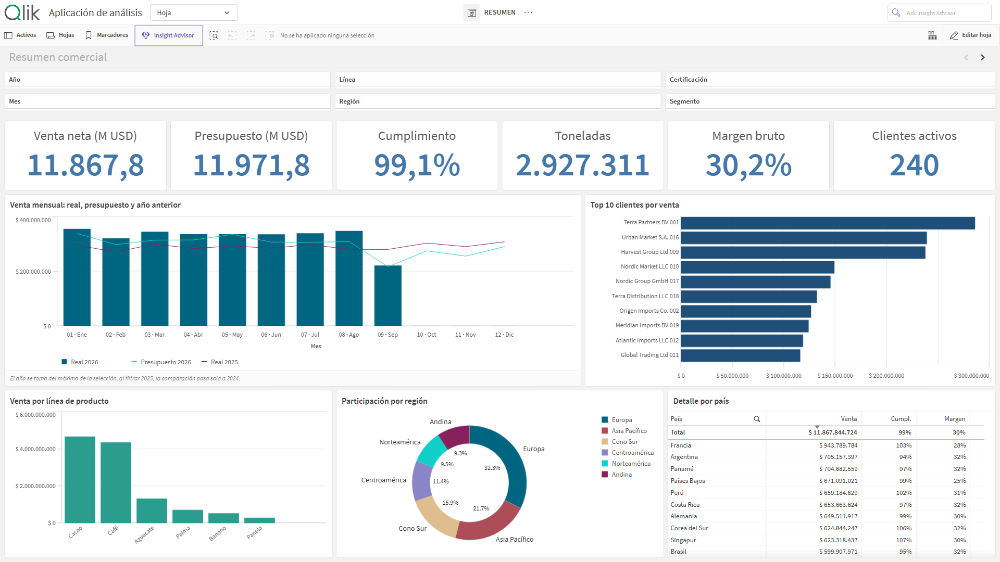
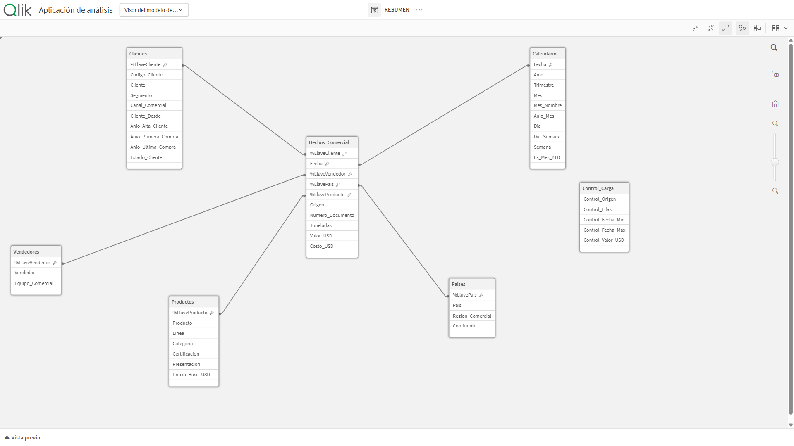
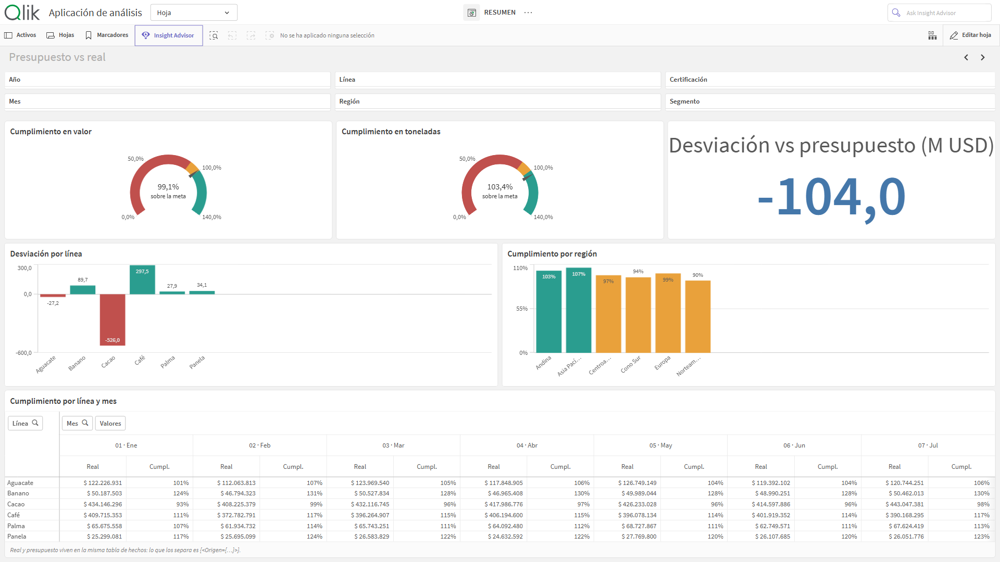
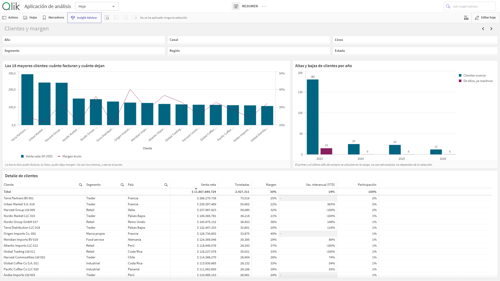
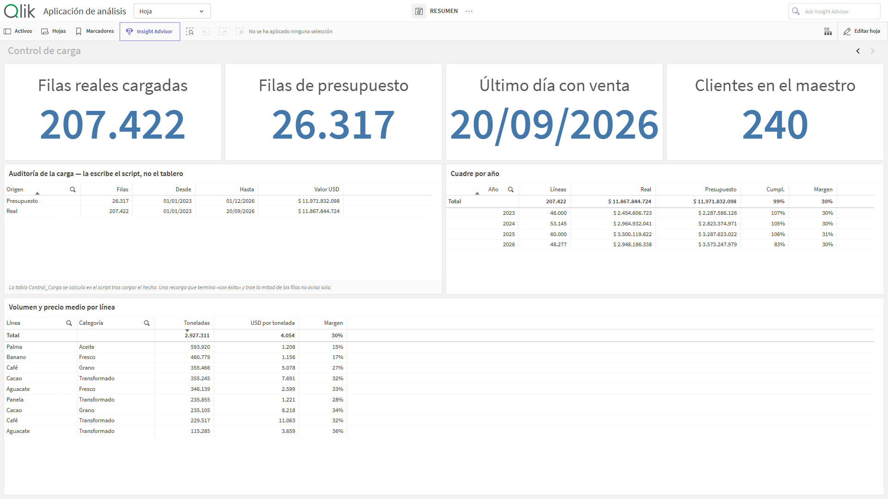
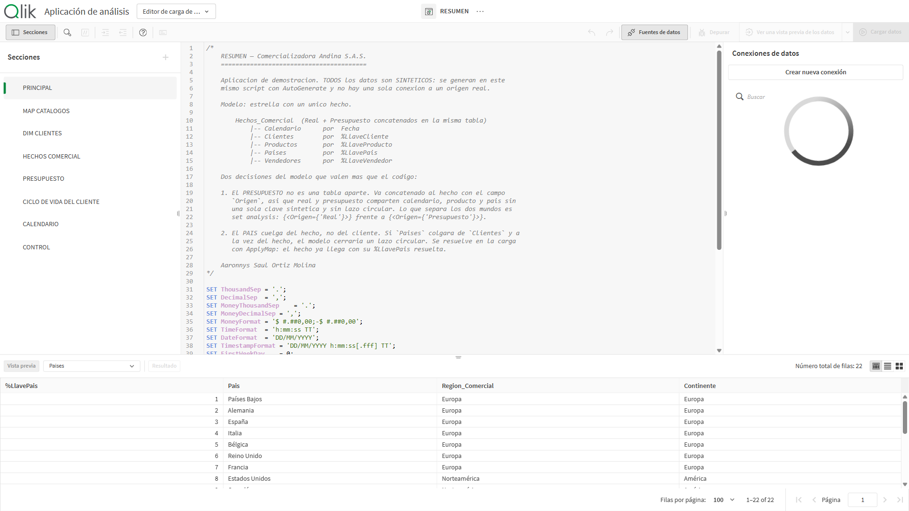

# Portafolio Qlik Sense — Aaronnys Saúl Ortiz Molina

Desarrollador Qlik Sense · Inteligencia de Negocios · Santa Marta, Colombia

**Sitio del portafolio:** https://portafolio-qlik.pages.dev

Este repositorio contiene **RESUMEN**, una aplicación de Qlik Sense de la carga al tablero:
script de carga, modelo de datos, variables de aplicación y cuatro hojas de análisis. Todos los
datos son sintéticos y los genera el propio script.



## La aplicación

| | |
|---|---|
| **Negocio** | Comercializadora agroexportadora: café, cacao, banano, aguacate, palma y panela hacia 22 países |
| **Volumen** | 232.000 líneas de factura y 26.000 de presupuesto |
| **Modelo** | Estrella: 1 tabla de hechos, 5 dimensiones y calendario maestro. 0 claves sintéticas, 0 lazos circulares |
| **Recarga** | ~6 segundos |

## Modelo de datos



- **Presupuesto concatenado a la tabla de hechos** con un campo `Origen` (`Real` / `Presupuesto`),
  en lugar de una tabla aparte. Real y presupuesto comparten calendario, producto y país sin
  generar claves sintéticas; lo que los separa es set analysis.
- **El país cuelga de la tabla de hechos, no del cliente.** Se resuelve en la carga con
  `ApplyMap`, lo que evita el lazo circular entre hechos, clientes y países.
- **Catálogos cargados primero**, cada uno dejando su tabla de mapeo. La tabla de hechos resuelve
  todas sus llaves con `ApplyMap` y no usa ningún `JOIN`.
- **Calendario maestro** generado sobre el rango real de los hechos, con una marca `Es_Mes_YTD`
  para comparaciones interanuales recortadas por el mismo mes de corte.

## Hojas

### Resumen comercial
KPI de venta, presupuesto, cumplimiento, toneladas, margen y clientes activos; serie mensual
contra presupuesto y contra el año anterior; top de clientes, participación por región y detalle
por país.

### Presupuesto contra real


Medidores de cumplimiento en valor y en volumen, desviación por línea con color por expresión,
cumplimiento por región y tabla dinámica de línea por mes.

### Clientes y margen


Facturación y margen de los quince mayores clientes en un gráfico combinado de doble eje, altas y
bajas de cartera por año, y detalle de clientes con variación interanual y participación.

### Control de carga


Tabla de auditoría calculada en el propio script después de cargar los hechos: filas por origen,
rango de fechas y valor total, más el cuadre por año.

## Set analysis

Las medidas viven en variables de aplicación y se reutilizan en todas las hojas.

```
// Real y presupuesto sobre la misma tabla de hechos
vVentaReal       = (Sum({<Origen={'Real'}>}        Valor_USD))
vVentaPpto       = (Sum({<Origen={'Presupuesto'}>} Valor_USD))
vCumplimiento    = ($(vVentaReal) / $(vVentaPpto))

// Año dinámico: la comparación sigue a la selección
Sum({<Origen={'Real'}, Anio={$(=Max(Anio))}>}   Valor_USD)
Sum({<Origen={'Real'}, Anio={$(=Max(Anio)-1)}>} Valor_USD)

// Interanual comparable: los dos años recortados por el mismo mes
vVentaYTD          = (Sum({<Origen={'Real'}, Anio={$(=Max(Anio))},   Es_Mes_YTD={1}>} Valor_USD))
vVentaYTDAnterior  = (Sum({<Origen={'Real'}, Anio={$(=Max(Anio)-1)}, Es_Mes_YTD={1}>} Valor_USD))

// Participación sobre el total
(Sum({<Origen={'Real'}>} Valor_USD) / Sum(TOTAL {<Origen={'Real'}>} Valor_USD))
```

## Script de carga



[`script/resumen.qvs`](script/resumen.qvs) — ocho pestañas:

| Pestaña | Contenido |
|---|---|
| `PRINCIPAL` | Formatos regionales, fecha de corte y parámetros |
| `MAP CATALOGOS` | Países, productos y vendedores, con sus tablas de mapeo |
| `DIM CLIENTES` | Maestro de clientes y ventana de cartera por año |
| `HECHOS COMERCIAL` | Líneas de factura generadas año por año, con preceding loads encadenados |
| `PRESUPUESTO` | Meta mensual concatenada a la tabla de hechos |
| `CICLO DE VIDA DEL CLIENTE` | Primer y último año de compra, resueltos en la carga |
| `CALENDARIO` | Calendario maestro sobre el rango real de los hechos |
| `CONTROL` | Tabla de auditoría de la carga |

## Estructura

```
script/     resumen.qvs — script de carga completo
capturas/   las cuatro hojas, el visor del modelo y el editor de carga
```

## Contacto

aaronnysortizmolina@gmail.com · https://portafolio-qlik.pages.dev
